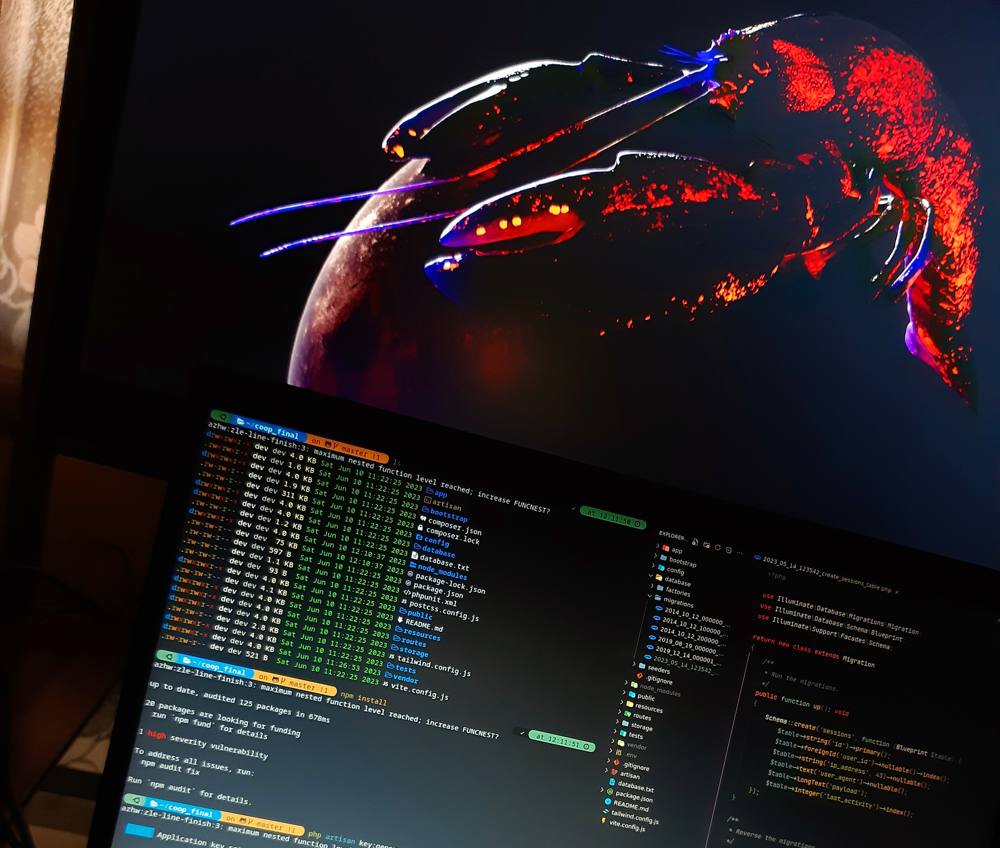

# **SETUP UBUNTU FOR CODING**

Copyright © 2022 [04burhanuddin](https://github.com/04burhanuddin)

**Warning**: Don't blindly use this configuration, unless you know what you need. Use at your own risk!.



## Table Of Contents

- Download Ubuntu
- Update all system & driver
- Install firewall
- Install GIT
- Install Editor
- Oh My ZSH & Plugin ZSH
- Install Apache 2
- Install Mysql Server
- Install PHP
- Manage Database
- Install Composer
- Install Java
- Install Android Studio
- Install Flutter
- Install Node JS Using NVM
- Install Python 3
- Laravel Global Installer
- Others

## Download Ubuntu

- [https://ubuntu.com/download/desktop](https://ubuntu.com/download/desktop) - Download Ubuntu
- [https://rufus.ie/en/](https://rufus.ie/en/) - Download Rufus atau,
- [https://etcher.balena.io/](https://etcher.balena.io/) - Balena Eatcher

> Silahkan install, gunakan `minimal installation` biar tidak banyak app bawaan kayak game dll.

## Update semua pembaruan system dan driver

```sh
sudo apt-get update && sudo apt-get dist-upgrade -y
```

## Install Firewall

```shell
sudo apt-get install gufw -y
# silahkan buka gufw untuk manage akses firewall
```

## Install GIT

```shell
# untuk mendapatkan update secara berkala
sudo add-apt-repository ppa:git-core/ppa
sudo apt-get install git
```

Settings ssh git
> [referensi here](https://docs.github.com/en/authentication/connecting-to-github-with-ssh/generating-a-new-ssh-key-and-adding-it-to-the-ssh-agent)

```shell
cd ~/.ssh
ssh-keygen -t rsa -b 4096 -C "contoh@gmail.com"


Generating public/private rsa key pair.
Enter file in which to save the key (/home/dev/.ssh/id_rsa): YOUR_ID
Enter passphrase (empty for no passphrase):
Enter same passphrase again:
Your identification has been saved in ....
Your public key has been saved in ....pub
The key fingerprint is:
SHA256:SJ6tYaXowqW0CB..............
The key's randomart image is:
+---[RSA 4096]----+
|==o.o. .. . |
|B ++o.. . . |
|o+.=o.. . . |
|.oooo+ * . |
|. +.o B S o E|
|.+ = . o . . +.|
|. = . . o =|
| . .o+|
| ...o|
+----[SHA256]-----+


cat ~/.ssh/YOUR_ID.pub
# copy semua dan simpan ke ssh keys github settings -> SSH and GPG Keys -> new ssh


eval "$(ssh-agent -s)"
ssh-add ~/.ssh/YOUR_ID HERE


# pastikan sudah sukses seperti ini
ssh -T git@github.com
Hi ....! You've successfully authenticated, but GitHub does not provide shell access.
```

> Setelah komputer/laptop reboot, SSH key tidak bisa digunakan harus ditambahkan lagi baru bisa.

Nah biar ga ribet `ss-add ...` buat file baru dengan nama `config`

```shell
nvim ~/.ssh/config
```

copy dan paste ke dalam file `config`

```shell
# Github.com server
Host github.com
IdentityFile ~/.ssh/ID_RSA
```

## Install Editor

Disini ada dua editor yang sering saya gunakan yaitu `Neovim` dan `VS Code`

```shell
# install neovim
sudo apt-get install neovim


# install vs code menggunakan snap
sudo snap install code --classic


# atau download langsung pada website dan download file .deb
# contoh install
sudo dpkg -i VS-CODE.deb
```

## Install oh my zsh

```sh
sudo apt-get install zsh -y


# menjadikan zsh sebagai default shell setelah itu logout and login kembali
# buka terminal dan pilih opsi 2 untuk menggunakan pengaturan default zsh
chsh -s /usr/bin/zsh


# unduh script untuk pemasangan zsh
sh -c "$(wget https://raw.githubusercontent.com/robbyrussell/oh-my-zsh/master/tools/install.sh -O -)"


# gunakan konfigurasi bawaan zsh yang direkomendasikan
cp ~/.oh-my-zsh/templates/zshrc.zsh-template ~/.zshrc


# untuk mengganti theme
sudo nano ~/.zshrc


# perhatikan pada baris
ZSH_THEME="masukkan_naam_theme_pilihanmu"
# check theme zsh https://github.com/ohmyzsh/ohmyzsh/wiki/Themes


# dan untuk apply semua perubahan jika tidak berubah close dan buka terminal lagi
source ~/.zshrc
```

Install plugin zsh

```shell
# untuk memasang clone semua plugin ini
# autosuggestions plugin
git clone https://github.com/zsh-users/zsh-autosuggestions.git $ZSH_CUSTOM/plugins/zsh-autosuggestions


# zsh-syntax-highlighting plugin
git clone https://github.com/zsh-users/zsh-syntax-highlighting.git $ZSH_CUSTOM/plugins/zsh-syntax-highlighting


# zsh-fast-syntax-highlighting plugin
git clone https://github.com/zdharma-continuum/fast-syntax-highlighting.git ${ZSH_CUSTOM:-$HOME/.oh-my-zsh/custom}/plugins/fast-syntax-highlighting


#zsh-autocomplete plugin
git clone --depth 1 -- https://github.com/marlonrichert/zsh-autocomplete.git $ZSH_CUSTOM/plugins/zsh-autocomplete


# implementasi
# Open ~/.zshrc
# cari bagian plugins=(git)
# copy dan paste code dibawah ini kedalam plugins menjadi seperti ini
plugins=(git zsh-autosuggestions zsh-syntax-highlighting fast-syntax-highlighting zsh-autocomplete)
```

Baca juga [https://github.com/romkatv/powerlevel10k](https://github.com/romkatv/powerlevel10k) - biar gak gitu-gitu aja tampilannya

## Install Apache 2

```shell
sudo apt install apache2 -y


# manage apache
sudo systemctl status apache2
sudo systemctl stop apache2
sudo systemctl start apache2
sudo systemctl restart apache2
sudo systemctl reload apache2
sudo systemctl disable apache2
sudo systemctl enable apache2


# Izin akses apache pada firewall
sudo ufw app list
sudo ufw allow 'Apache Full'
sudo ufw status
```

## Install PHP

```shell
sudo apt-get install php -y


# install semua module php ini
sudo apt install php-mbstring php-zip php-gd php-json php-curl libapache2-mod-php php-mysqlnd php-xml -y
```

## Install Mysql Server

```shell
sudo apt-get install mysql-server -y


# manage mysql service
sudo systemctl start mysql.service


# manage user
sudo mysql
ALTER USER 'root'@'localhost' IDENTIFIED WITH mysql_native_password BY 'NEW_PASSWORD';
mysql -u root -p
sudo mysql_secure_installation


# determine the strength of the password
SHOW VARIABLES LIKE 'validate_password%';
SET GLOBAL validate_password.policy = 0; // For LOW
SET GLOBAL validate_password.policy = 1; // For MEDIUM
SET GLOBAL validate_password.policy = 2; // For HIGH


# manage user
SELECT user, host FROM mysql.user;
drop user name_user@localhost;


create user 'username'@'localhost' identified by 'password';
GRANT ALL PRIVILEGES ON *.* TO 'username'@'localhost' WITH GRANT OPTION;
FLUSH PRIVILEGES;


# login dengan user baru
sudo mysql -u username -p
```

## Manage Database

Ada beberapa opsi untuk kamu jika ingin mengelola database yaitu bisa menggunakan :

- [Table Plus](https://tableplus.com/) - Easy, modern, native and friendly GUI (Rekomended)
- [Beekeeper-Studio](https://www.beekeeperstudio.io/) - Modern and easy to use
- Phpmyadmin (Tidak rekomended)
- Menggunakan Plugin VS Code (Rekomended)
- Menggunakan Terminal Langsung (Sangat Rekomended)
- dll

**Panduan Instalasi**

- Install Table plus on ubuntu 22.04

```shell
# Add TablePlus gpg key
wget -qO - https://deb.tableplus.com/apt.tableplus.com.gpg.key | gpg --dearmor | sudo tee /etc/apt/trusted.gpg.d/tableplus-archive.gpg > /dev/null


# Add TablePlus repo
sudo add-apt-repository "deb [arch=amd64] https://deb.tableplus.com/debian/22 tableplus main"


# Install
sudo apt update
sudo apt install tableplus
```

> Note: masih beta version

- Install Beekeeper Studio

```shell
sudo snap install beekeeper-studio
```

- Install phpmyadmin

> pastikan semua module php yang dibutuhkan sudah di install semua di atas.

```shell
sudo apt-get phpmyadmin -y


# ikuti semua instruksi dan perhatikan baik-baik pastikan memilih apache dan untuk username gunakan root atau user baru yang dibuat pada saat konfigurasi mysql-server, rekomendasi gunakan root saja
```

- Menggunakan Plugin VS Code

Install extension `SQLTools MySQL/MariaDB/TiDB` dan `MySQL` cari yang sudah centang. tinggal buat connection baru.

## Install Node Js Using NVM

Baca lengkap [https://github.com/nvm-sh/nvm](https://github.com/nvm-sh/nvm)

```shell
# get nvm
curl -o- https://raw.githubusercontent.com/nvm-sh/nvm/v0.39.3/install.sh | bash


# sekarang cek nvm --version jika versi keluar maka tidak perlu mengedit bash profile
# edit bash profile jika nvm kamu bermasalah saat cek veri nvm
sudo nvim ~/.zshrc


# untuk memuat semua perubahan
source ~/.zshrc


# copy dan paste code di bawah ini ke baris paling akhir bash profile di sini saya menggunakan zsh
export NVM_DIR="$([ -z "${XDG_CONFIG_HOME-}" ] && printf %s "${HOME}/.nvm" || printf %s "${XDG_CONFIG_HOME}/nvm")"
[ -s "$NVM_DIR/nvm.sh" ] && \. "$NVM_DIR/nvm.sh"
# setelah itu close dan buka terminal cek kembali nvm --version harusnya sudah bisa.


# untuk melihat semua versi node js
nvm list-remote


# install node js
nvm install VERSI_NODEJS
# atau, untuk menginstall node js versi lts paling terbaru.
nvm install -lts


# mengatur default versi node js
nvm use VERSI_NODEJS
nvm alias default VERSI_NODEJS
```

## Install Python 3

By default sistem di ubuntu sudah ada bawaan python3, untuk memastikannya ketik perintah,
baca leangkap di sini [Digital ocean install python 3](https://www.digitalocean.com/community/tutorials/how-to-install-python-3-and-set-up-a-programming-environment-on-an-ubuntu-20-04-server-id)

```shell
python3 --version


# jika tidak ada install
sudo apt-get install python3


# install pip untuk mengelola package pada python
sudo apt install -y python3-pip


# install package sesuai kebutuhan
pip3 install PACKAGE_NAME
```

## Install Java

Install java OpenJDK 17 atau versi lainnya disini saya menggunakan versi 17

```shell
sudo apt install openjdk-17-jdk
java --version //untuk melihat versi java yang telah di install


sudo update-alternatives --config java
sudo nano /etc/environment
source /etc/environment
echo $JAVA_HOME


# contoh cara uninstall java
sudo apt remove openjdk-8-jdk
# untuk membersihakan semua paket yang tidak digunakan
sudo apt-get autoremove
sudo apt-get autoclean
sudo apt-get clean
```

## Install Android Studio

```sh
sudo snap install android-studio --classic
```

> Pastikan koneksi internet kamu cepat dan tidak lemot untuk mendownload semua yang dibutuhkan termasuk Gradle SDK dll pada android studio.

## Install Flutter

- Pastikan java sudah terintall dan Android Studio
- Buka Android Studio->pilih menu SDK Manager->pilih tab SDK Tools install beberapa SDK Tools
Cukup install tambahan `Android SDK Command-line Tools`
- Install flutter disini menggunakan snap pastikan koneksi internet kamu kencang untuk mendownload binary file

```shell
# tunggu sampai selesai
sudo snap install flutter --classic


# Resolve semua dependencies yang dibutuhkan
flutter doctor -v


# pastikan tidak ada yang error ya
```

- Install manual

Download file tar.xz terlebih dahulu di [https://docs.flutter.dev/get-started/install/linux](https://docs.flutter.dev/get-started/install/linux)

```shell
# buat folder baru agar rapi bebas saja nama foldernya
mkdir development


# file flutter yang di download tadi pindahkan kedalam folder development
cd development


# extract file flutter .tar.xz setelah di extract silahkan remove file .tar.xz
unzip flutter_linux_3.10.5-stable.tar.xz
rm flutter_linux_3.10.5-stable.tar.xz


# export path untuk flutter
export PATH="$PATH:`pwd`/flutter/bin"


# atau tambahkan manual pada bash profile misal
export PATH="$PATH:/home/YUR_USER/development/flutter/bin"


# kemudian jalankan perintah untuk resolve semua dependencies yang dibutuhkan
flutter doctor -v
# pastikan tidak ada error lagi


# manage flutter, recommended disable saja yang tidak diperlukan
flutter config --no-enable-web
flutter config --no-enable-macos-desktop
flutter config --no-enable-windows-desktop
flutter config --no-enable-linux-desktop
```

## Install Composer

```sh
php -r "copy('https://getcomposer.org/installer', 'composer-setup.php');"
php -r "if (hash_file('sha384', 'composer-setup.php') === '55ce33d7678c5a611085589f1f3ddf8b3c52d662cd01d4ba75c0ee0459970c2200a51f492d557530c71c15d8dba01eae') { echo 'Installer verified'; } else { echo 'Installer corrupt'; unlink('composer-setup.php'); } echo PHP_EOL;"
php composer-setup.php
php -r "unlink('composer-setup.php');"
```

Pindahkan `composer.phar` kedalam direktori pada `/usr/local/bin/` untuk menjadikan composer global install, jadi pada direktori manapun anda bisa memanggil composer

```sh
sudo mv composer.phar /usr/local/bin/composer
```

cek kembali tutup terminal dan buka lagi kemudian ketikkan `composer` harusnya nggak ada error ngab

## Install Laravel Secara Global

```sh
composer global require laravel/installer


# edit bash profile
sudo nvim ~/.zshrc
# copy dan paste baris di bawah ini pada bagian akhir .zshrc
export PATH="$HOME/.config/composer/vendor/bin:$PATH"


# apply semua
source ~/.zshrc


# cek versi laravel global yang di install
laravel --version


# membuat project dengan menggunakan laravel global installer
laravel new Nama_Project


# contoh cara membuat project laravel dengan versi laravel 6
composer create-project --prefer-dist laravel/laravel blog "6.*"
```

## Other

- [LSDeluxe](https://github.com/lsd-rs/lsd) - Menampilkan icon pada terminal baca lengkap panduan biar gada yang error
- [https://www.gnome-look.org/](https://www.gnome-look.org/) - Download wallpaper, theme, icon dll
- [Vimix-Cursor](https://github.com/vinceliuice/Vimix-cursors) - Baca readme.md
- [MongoDB](https://www.mongodb.com/docs/manual/tutorial/install-mongodb-on-ubuntu/) - Official Documentation
- [OBS Studio](https://obsproject.com/download) - Official Documentation
- [yt-dl](http://ytdl-org.github.io/youtube-dl/download.html) - Youtube-dl Downloads
- [Firebase-CLI](https://firebase.google.com/docs/cli#install-cli-mac-linux) - Linux Installation

```shell
# install discord
sudo snap install discord


# install postman
sudo snap install postman


# install obs studio
sudo snap install obs-studio


# install spotify
sudo snap install spotify
```

> Nggak harus pake snap kok, tinggal download file .deb di website resmi dan execute dengan `sudo dpkg -i ....`

## Butuh Bantuan 🤣

[Discord](https://discordapp.com/users/04burhanuddin) - Contact
