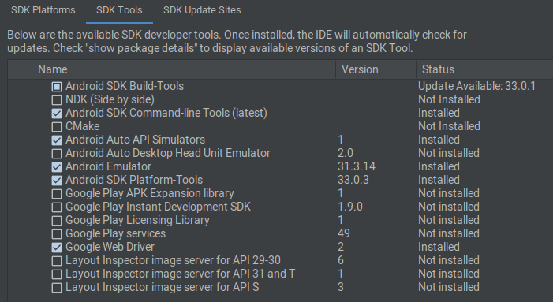

# After Installing Ubuntu For Programming
> Install sesuai kebutuhan :
- [Update all sistem & driver](#first)
- [GIT](#git)
- [OH MY ZSH](#zsh)
- [PowerLevel 10k ZSH](#p10k)
- [Apache 2](#apache2)
- [PHP](#php)
- [Mysql Server](#mysqlServer)
- [Phpmyadmin](#phpmyadmin)
- [Beekeper Studio](#beekeperStudio)
- [Visual Studio COde](#vscode)
- [Java](#java)
- [Android Studio](#androidStudio)
- [Node JS](#nodejs)
- [Python 3](#python3)
- [Flutter](#flutter)
- [Composer](#composer)
- [Laravel Global Installer](#laravel)

### <span id="first" style="color:orange">Update semua pembaruan system dan driver</span>
```sh
sudo apt-get update && sudo apt-get dist-upgrade -y
```

### <span id="git" style="color:orange">Install GIT</span>
- Menambahkan Repository PPA & install untuk mendapatkan pembaruan secara berkala dari GIT
    ```sh
    sudo add-apt-repository ppa:git-core/ppa
    sudo apt-get install git
    ```

### <span id="zsh" style="color:orange">Install oh my zsh</span>
- Donwload and install zsh
     ```sh
    sudo apt-get install zsh
    ```
- Menjadikan zsh sebagai default shell/menjadikan sebagai default terminal
     ```sh
     chsh -s /usr/bin/zsh
    ```
    Kemudian logout account/user dan login kembali dan buka terminal pilih No. 2 add ~/.zshrc agar kedepannya bisa melakukan costum shell zsh

- Mengunduh scrip untuk pemasangan zsh
     ```sh
     sh -c "$(wget https://raw.githubusercontent.com/robbyrussell/oh-my-zsh/master/tools/install.sh -O -)"
    ```
    Jika berhasil harunya tampil oh my zsh pada terminal

- Mengganti konfigurai default bawaan zsh ke konfigurasi yang di sarankan dengan perintah
     ```sh
    cp ~/.oh-my-zsh/templates/zshrc.zsh-template ~/.zshrc 
    ```
- Untuk mengganti theme pada zsh gunakan perintah
     ```sh
    sudo nano ~/.zshrc
    ```
- Fokus pada baris bagian ZSH_THEME
    ```sh
    ZSH_THEME="masukkan_naam_theme_pilihanmu"
    ```
    [Pilih theme zsh sesuai kesukaan](https://github.com/ohmyzsh/ohmyzsh/wiki/Themes)

- Untuk melihat perubahan gunakan perintah
    ```sh
    source ~/.zshrc
    ```

### <span id="p10k" style="color:orange">Install Powerlevel 10K</span>
Opsional jika kamu butuh terminal yang lebih keren lagi menurut saya keren ngab 😂
- Pastika **zsh** sudah terpasang
- Biar tidak terjadi kesalahan pastikan termila kamu sudah menggunakan font **MesloLGS NF**
[Download Font](https://github.com/romkatv/powerlevel10k-media/blob/master/MesloLGS%20NF%20Regular.ttf?raw=true)
- Download dan install powerlevel10k dengan cara cloninf repository
    ```sh
    git clone --depth=1 https://github.com/romkatv/powerlevel10k.git ${ZSH_CUSTOM:-$HOME/.oh-my-zsh/custom}/themes/powerlevel10k
    ```
- Konfigurasi theme sesuai pilihanmu dengan menggunakan perintah ini pada terminal
    ```sh
    p10k configure
    ```
- Selengkpanya kunjungi repo [powerlevel10k](https://github.com/romkatv/powerlevel10k)

### <span style="color:orange">Install Apache 2</span>
- Download & install apache 2
    ```sh
    sudo apt-get update && sudo apt install apache2
    ```
- Managing Apache 2
    ``` sh
    sudo systemctl status apache2
    sudo systemctl stop apache2
    sudo systemctl start apache2
    sudo systemctl restart apache2
    sudo systemctl reload apache2
    sudo systemctl disable apache2
    sudo systemctl enable apache2
    ```
- Konfigurasi Firewall 
    ```sh
    sudo ufw app list
    sudo ufw allow 'Apache Full
    sudo ufw status
    ```

- if you want to do a costum domain you can check on google

### <span id="php" style="color:orange">Install PHP</span>
- Install PHP
    ```sh
    sudo apt-get install -y php libapache2-mod-php
    ```

## <span id="mysqlServer" style="color:orange">Install Mysql Server</span>
- Download dan install mysql server
    ```sh
    sudo apt install mysql-server
    ```
- Managing Mysql-server 
    ```sh
    sudo systemctl start mysql.service
    ```
- Manage User Database 
    ```sh
    sudo mysql

    ALTER USER 'root'@'localhost' IDENTIFIED WITH mysql_native_password BY 'password';
    ```
    ```sh
    mysql -u root -p

    ALTER USER 'root'@'localhost' IDENTIFIED WITH auth_socket;  // Optional
    ```
    ```
    sudo mysql_secure_installation
    ```
- Determine the strength of the password
    ```
    SHOW VARIABLES LIKE 'validate_password%';

    SET GLOBAL validate_password.policy = 0;   // For LOW 
    SET GLOBAL validate_password.policy = 1;   // For MEDIUM 
    SET GLOBAL validate_password.policy = 2;   // For HIGH 
    ```
- Create new user
    ```
    SELECT user, host FROM mysql.user;  // Show User
    drop user name_user@localhost;      // Delete User

    create user 'username'@'localhost' identified by 'password';
    GRANT ALL PRIVILEGES ON *.* TO 'username'@'localhost' WITH GRANT OPTION;
    FLUSH PRIVILEGES; 
    ```
- If you want to login with new user then use
    ```
    mysql -u username -p
    ```

## <span id="nodejs" style="color:orange">Install Node Js</span>
> Saran gunakan NVM untuk menginstall node js
- Install NVM (Node Version Manager) mengapa pake nvm, menggunakan nvm kamu bisa menginstall node js versi yang berbeda di laptop kamu
- Install NVM menggunakan perintah
    ```sh
    curl -o- https://raw.githubusercontent.com/nvm-sh/nvm/v0.39.3/install.sh | bash
    ```
- Jika sudah selesai cek Versi nvm yang terinstall untuk memastikan benar-benar sudah terintall jika mengalami kendala update PATH
- Jika kamu menggunakan zsh sebagai default shell tambahkan PATH pada shell profile dengen menggunakan perintah
    ```sh
    sudo nano ~/.zshrc
    ```
- Pada baris bagian akhir tambahkan
    ```sh
    export NVM_DIR="$([ -z "${XDG_CONFIG_HOME-}" ] && printf %s "${HOME}/.nvm" || printf %s "${XDG_CONFIG_HOME}/nvm")"
    [ -s "$NVM_DIR/nvm.sh" ] && \. "$NVM_DIR/nvm.sh" # This loads nvm
    ```
- Dan cek lagi versi harusnya sudah keluar versi vnm kamu
- Lalu bagaimana menginstall node js menggunakan nvm tenag ngab gampang banget gunakan perintah
    ```sh
    nvm list-remote
    ```
    Tinggal pilih mau install node js versi berapa, mau install lebih dari 1 boleh ngab cara install nya menggunakan
    ```sh
    nvm install Veri_NodeJS
    
    // atau
    nvm install –lts 
    ```
    Lalu bagaiman jika ingin menggunakan node versi yang lain yang sudah kamu install gunakan perintah di ikuti dengan versi node yang ingin kamu gunakan
    ```sh
    nvm use Versi_NodeJS

    // untuk memgatur defailt versi node yang akan kamu gunakan
    nvm alias default Versi_NodeJS 
    ```

## <span id="python3" style="color:orange">Install Python 3</span>
- By default sistem di ubutnu sudah ada bawaan python3, untuk memastikannya ketik perintah
    ```sh
    python3 --version
    ```
- Install `pip` untuk mengelola package pada python
    ```sh
    sudo apt install -y python3-pip
    ```
- Untuk menginstall package gunaan perintah
    ```sh
    pip3 install Package_Name
    ```
## <span id="java" style="color:orange">Install Java/JDK</span>
- Install java OpenJDK 17 atau versi lainnya di sini saya mengguankan versi 17
    ```sh
    sudo apt install openjdk-17-jdk

    java --version //untuk melihat versi java yang telah di install
    ```
    JRE sudah termasuk dalam paket JDK. Jika hanya membutuhkan JRE, instal paket `openjdk-17-jre`. Untuk Java runtime minimal, install paket `openjdk-17-jdk-headless`
- Bagaimana jika anda ingin menggunakan versi java yang versi lain juga santuy aja ngab bisa install 2 versi kok dengan cara install java versi yang di inginkan terlebih dahulu dan kemudian kita akan mengatur default java yang akan digunakan dengan menambahkan environment variabel
- Example saat ini kamu punya 2 versi java yang berbeda dalam satu perangkat/laptop yang gunakan kita akan mengatur agar java default nya adalah, anggaplah versi 8 dan 17 yang barusan di install ketikkan perintah berikut
    ```sh
    sudo update-alternatives --config java
    ```
    Nanti akan muncul semua versi java yang sudah kamu install pilih versi java yang akan di jadikan sebagai default 
- Mengatur variabel environment JAVA_HOME dengan menggunakan perintah
    ```sh
    sudo update-alternatives --config java
    ```
- Kemudian ketikkan perintah
    ```sh
    sudo nano /etc/environment
    ```
    Tambahkan baris baru `JAVA_HOME="/usr/lib/jvm/java-8-openjdk-amd64"`<br>
    Path location installer java di dapatkan pada saat mengetikkan perintah `sudo update-alternatives --config java`
- Untuk mendapatkan perubahan anda bisa menggunakan perintah
    ```sh
    source /etc/environment
    ```
- Cek lagi apakah sudah benar dengan mengetikkan perintah
    ```sh
    echo $JAVA_HOME 
    ```
    Pastikan path pada JAVA_HOME sudah sesuai dengan versi yang anda pilih.
- Lalu bagaimana jika kamu ingin menhapus java yang sudha di install, tenang ngab tinggal gunakan perintah ini
    ```sh
    sudo apt remove openjdk-8-jdk

    // untuk membersihakan semua paket yang tidak digunakan
    sudo apt-get autoremove
    sido apt-get autoclean
    sudo apt-get clean
    ```
## <span id="androidStudio" style="color:orange">Install Android Studio</span>
- Download dan install android studio
    ```sh
    sudo snap install android-studio --classic
    ```
- Pastikan koneksi intenet kamu cepat dan tidak lemot untuk mendownload semua yang dibutuhkan termasuk Gradle SDK dll pada androis studio.
## <span id="flutter" style="color:orange">Install FLutter</span>
- Pastikan java sudah terintall dan Android Studio
- Buka Android Studio->pilih menu SDK Manager->pilih tab SDK Tools install beberapa SDK Tools
    
    Cukup install tambahan `Android SDK Command-line Tools` dan `Android SDK Platform Tools` 
- install flutter di sini mengguankan snap pastikan koneksi internet kamu kencang untuk mendownload binary file
- Seteleh berhasil ketikkan perintah berikut:
    ```sh
    flutter doctor -v
    ```
    Pastikan tidak ada error jika terjadi error perhatikan dan jalankan perintah yag di sarankan untuk android license dll
## <span id="phpmyadmin" style="color:orange">Install Phpmyadmin + Module PHP</span>
> Saya sarankan menggunakan extension vs code **SQLTools/MariaDB** atau Beekeper Studio atau mysql workbench, kalo nggak pake terminal aja ngab biar kek hecker 😎

Gunakan perintah ini untuk menginstall phpmyadmin dan beberapa modul php yang dibutuhkan untuk menjalankan phpmyadmin
```sh
sudo apt install -y phpmyadmin php-mbstring php-zip php-gd php-json php-curl libapache2-mod-php php-mysqlnd php-xml
```
## <span id="composer" style="color:orange">Install Composer</span>
- Download dan install Composer
    ```sh
    php -r "copy('https://getcomposer.org/installer', 'composer-setup.php');"
    php -r "if (hash_file('sha384', 'composer-setup.php') === '55ce33d7678c5a611085589f1f3ddf8b3c52d662cd01d4ba75c0ee0459970c2200a51f492d557530c71c15d8dba01eae') { echo 'Installer verified'; } else { echo 'Installer corrupt'; unlink('composer-setup.php'); } echo PHP_EOL;"
    php composer-setup.php
    php -r "unlink('composer-setup.php');"
    ```
- Pindahkan `composer.phar` kedalan direktori pada PATH untuk menjadikan composer global installer jadi pada direktory manapun anda bisa memanggil composer ngab tadi pas install di root kan seakarang pindahkan menggunakan perintah ini ngab
    ```sh
    sudo mv composer.phar /usr/local/bin/composer
    ```
    cek kembali tutup terminal dan buka lagi kemudian ketikkan `composer` harunsya nggak ada error ngab
    
## <span id="laravel" style="color:orange">Install Laravel Secara Global</span>
- Gunakan composer untuk menginstall laravel secara global menggunakan perintah
    ```sh
    composer global require laravel/installer
    ```
- Edit PATH, jika kamu menggunakan zsh atau bash
    ```sh
    export PATH="$HOME/.config/composer/vendor/bin:$PATH"
    ```
- Terakhir cek apakah benar PATH yang dibuat
    ```sh
    laravel --version
    ```
    Harusnya keluar versi laravel global installer ngab.
- untuk membuat project gunakan perintah
    ```sh
    laravel new Nama_Project
    ```
    Jika kamu ingin membuat project laravel dengan versi tertentu silakan gunakan composer ngab
    ```sh
    composer create-project --prefer-dist laravel/laravel blog "6.*"
    ```
    Perintah di atas contoh untuk menginstall laravel versi 6